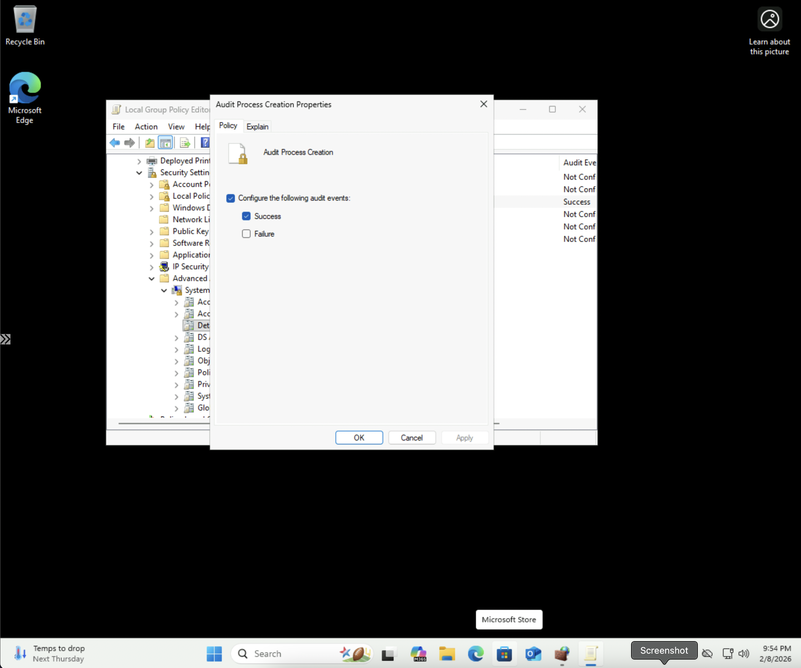

# Windows STIG WN11-AU-000050 Remediation

## Overview
This repository contains remediation for STIG vulnerability WN11-AU-000050: "The system must be configured to audit Detailed Tracking - Process Creation successes."

## Vulnerability Details
- **STIG-ID**: WN11-AU-000050
- **Severity**: CAT II
- **Description**: Maintaining an audit trail of system activity logs can help identify configuration errors, troubleshoot service disruptions, and analyze compromises that have occurred. Audit logs are necessary to provide a trail of evidence in case the system is compromised. Process creation events track when processes are launched on the system.

## Remediation Methods

### Automated (PowerShell Script)
Run the `remediation_WN11-AU-000050.ps1` script as Administrator to automatically enable Process Creation auditing.

**To run:**
```powershell
PS C:\> .\remediation_WN11-AU-000050.ps1
```

### Manual (Group Policy Editor)
1. Open Local Group Policy Editor (`gpedit.msc`)
2. Navigate to: `Computer Configuration` → `Windows Settings` → `Security Settings` → `Advanced Audit Policy Configuration` → `Audit Policies` → `Detailed Tracking`
3. Double-click **"Audit Process Creation"**
4. Check **"Configure the following audit events"**
5. Check **"Success"**
6. Click **OK**
7. Open Command Prompt as Administrator and run: `gpupdate /force`
8. Verify with: `auditpol /get /category:"Detailed Tracking"`

## Screenshots

### Group Policy Configuration


### Verification


## Testing Information
- **Tested By**: Symone-Marie Priester
- **Date Tested**: February 8, 2025
- **System**: Windows 11 (Version 10.0.26200.7623)
- **PowerShell Version**: 5.1
- **Methods**: Both automated (PowerShell) and manual (Group Policy Editor)

## Repository Structure
```
├── remediation_WN11-AU-000050.ps1           # PowerShell remediation script
├── AuditProcessCreationProperties.png       # Group Policy configuration
├── gpudate_Solution_Verification.png        # Verification screenshot
└── README.md                                # This file
```

## Author
**Symone-Marie Priester**
- LinkedIn: [linkedin.com/in/symone-mariepriester](https://linkedin.com/in/symone-mariepriester)
- GitHub: [github.com/Symone-Marie](https://github.com/Symone-Marie)
